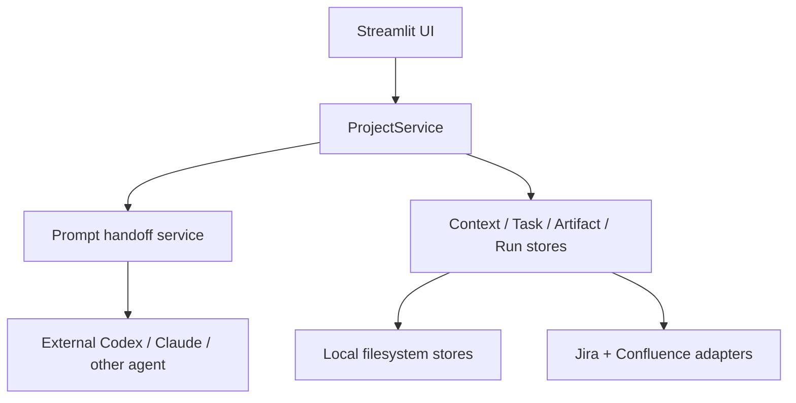

# Architecture

## What This Project Is

`AI_Japan_project` is an agent-agnostic orchestration harness for business-facing AI work.

It does **not** embed a model provider directly. Instead, it:

- stores project context
- manages work state
- generates role-specific work packets
- captures artifacts and reviews
- syncs canonical state to Jira and Confluence when Atlassian mode is enabled

The external reasoning work still happens in tools the user already owns, such as Codex or Claude.

## Responsibilities

The harness owns six responsibilities:

1. Context management
2. Task state management
3. PM / Critic packet generation
4. Artifact persistence
5. Jira / Confluence synchronization
6. External agent handoff orchestration

## Runtime Modes

### Local mode

- `project/context.yaml` and `project/03_context.md` are the canonical context
- `project/tasks/*.yaml` are the canonical tasks
- `project/artifacts/*.md` are the canonical artifacts
- `project/runs/*` stores packets and run history

### Atlassian mode

- Jira is the canonical task store
- Confluence is the canonical context and artifact store
- `project/runs/*` is still local and stores packets plus run history
- the same `ProjectService` and UI flow are reused; only the backing stores change

## Layered Design

## Main Modules

### `app_ui/`

The Streamlit layer is intentionally thin. It renders:

- dashboard and shell state
- context editing
- task workflow screens
- artifact and review views

The UI should stay lightweight; orchestration rules belong in the service layer.

### `src/ai_japan_project/service.py`

`ProjectService` is the main application boundary. It handles:

- task creation
- PM packet dispatch
- PM artifact ingest
- Critic packet dispatch
- Critic review ingest
- dashboard aggregation

This is the core harness entry point.

### `src/ai_japan_project/storage.py`

Provides the local implementations for:

- context storage
- task storage
- artifact storage
- run storage

These are used directly in `local` mode and as bootstrap / packet support in `atlassian` mode.

### `src/ai_japan_project/atlassian.py`

Provides Jira and Confluence adapters.

Highlights from the current implementation:

- Jira task sync is fail-closed when issue existence cannot be trusted
- localized Jira workflow aliases are supported
- Confluence metadata uses both storage comments and content properties
- critic review artifacts preserve raw markdown with frontmatter so the current viewer contract stays stable

### `src/ai_japan_project/operations.py`

Provides operational tooling for the harness:

- readiness / preflight checks
- repeatable live smoke runs
- smoke receipt persistence
- cleanup planning and execution

## Canonical Data Contracts

### Work packets

The packet contract is Markdown-first. The harness generates a file, and the external agent is expected to return Markdown that satisfies the declared output contract.

### PM artifact

The PM output is stored as a Markdown document and treated as the canonical draft.

### Critic artifact

The Critic output remains raw Markdown with YAML frontmatter. The UI currently parses verdict, summary, and review lists from that raw document, so backend changes should preserve that contract unless the viewer is updated at the same time.

## Why the Harness Stays Agent-Agnostic

Keeping the harness agent-neutral has practical benefits:

- users can keep their preferred toolchain
- PM and Critic can run in separate threads or products
- model providers can change without forcing a storage or workflow rewrite
- Jira / Confluence remain the source of truth even when the execution agent changes
